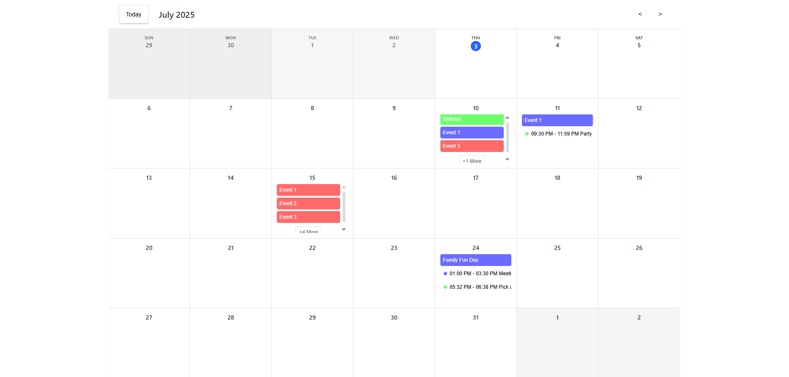
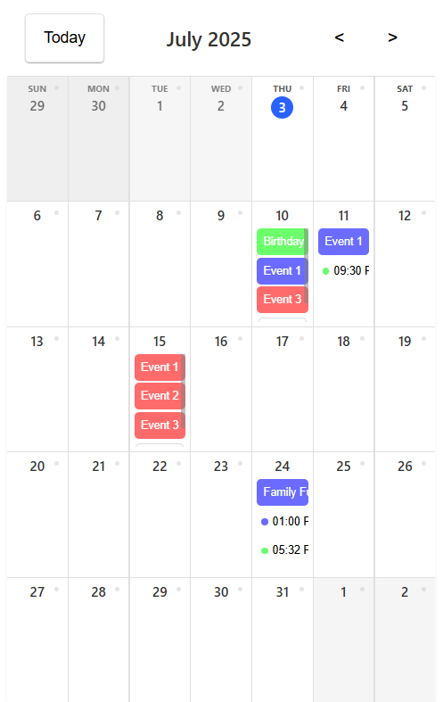
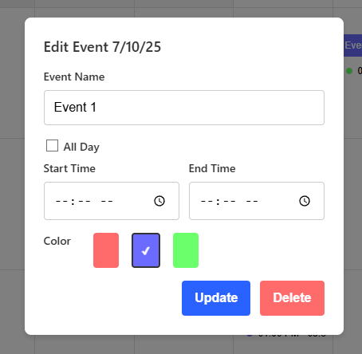
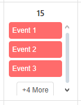

📅 React Calendar App

A modern, responsive calendar application built with React and TypeScript. Features event management, persistent storage, and a clean user interface that works seamlessly across all devices.

*Desktop view of the calendar application*

🌟 Features

✨ Core Functionality
- 📅 Interactive Calendar: Navigate between months with intuitive controls
- ➕ Event Management: Add, edit, and delete events with ease
- 🕐 Flexible Events: Support for both all-day and timed events
- 🎨 Color Coding: Organize events with red, blue, and green color options
- 💾 Persistent Storage: Events automatically saved to localStorage
- 📱 Fully Responsive: Perfect experience on mobile, tablet, and desktop

🎯 Advanced Features
- ⚡ Smart Overflow: "+X More" button for days with many events
- 🔍 Event Details: Click events to view and edit details
- ⌨️ Keyboard Navigation: Full keyboard accessibility support
- 🎭 Smooth Animations: Powered by Framer Motion for fluid interactions
- 🔒 Focus Management: Proper focus trapping in modals
- ✅ Form Validation: Comprehensive input validation with error messages

🎨 User Experience
- 🖱️ Hover States: Interactive feedback on all clickable elements
- 📍 Today Highlight: Current date clearly marked
- 🌅 Past Date Styling: Visual distinction for past dates
- 🎪 Modal System: Elegant overlay modals for event management
- 🎯 Touch Optimized: 44px minimum touch targets for mobile

🚀 Quick Start

Prerequisites
- Node.js (v16 or higher)
- npm or yarn package manager

Installation

1. **Clone the repository**
   bash
   git clone https://github.com/deziikuoo/CourseCareers-React-Calendar
   cd react-calendar-app
   

2. **Install dependencies**
   bash
   npm install
   

3. **Start the development server**
   bash
   npm run dev
   

4. **Open your browser**
   Navigate to `http://localhost:5173/`

Building for Production

bash
npm run build

📱 Screenshots

Desktop View

*Full desktop calendar view with events*

Mobile View

*Responsive mobile interface*

Event Management

*Event creation and editing modal*

Event Overflow

*Smart handling of multiple events per day*

🛠️ Technology Stack

Frontend
- ⚛️ React 18 - Modern React with hooks and functional components
- 📘 TypeScript - Type-safe development
- 🎨 CSS3 - Modern CSS with Grid, Flexbox, and responsive design
- 📅 date-fns - Lightweight date manipulation library
- 🎭 Framer Motion - Smooth animations and transitions
- 🔒 React Focus Lock - Accessibility-focused modal management

Development Tools
- ⚡ Vite - Fast build tool and development server
- 🔧 TypeScript - Static type checking
- 📏 ESLint - Code linting and formatting
- 🎯 Modern Browser APIs - localStorage, CSS Grid, Flexbox

Architecture
- 🏗️ Component-Based: Modular React components
- 🎣 Custom Hooks: Reusable logic with React hooks
- 📊 State Management: React useState and useCallback
- 🎯 Performance: Optimized with useMemo and useCallback
- ♿ Accessibility: ARIA labels, keyboard navigation, focus management

🎮 Usage Guide

Adding Events
1. Click the "+" button on any calendar day
2. Enter event details in the modal
3. Choose between all-day or timed events
4. Select a color for organization
5. Click "Add" to save

Editing Events
1. Click on any existing event
2. Modify details in the edit modal
3. Click "Update" to save changes
4. Use "Delete" to remove events

Navigation
- Today Button: Jump to current month
- Arrow Buttons: Navigate between months
- Keyboard: Use Tab and Enter for navigation
- Mobile: Touch-friendly interface

📂 Project Structure

src/
├── App.tsx               Main application component
├── Calendar.tsx          Core calendar component
├── Calendar.css          Responsive styling
├── main.tsx             Application entry point
├── types/               TypeScript type definitions
└── utils/               Utility functions

public/
├── index.html           HTML template
└── screenshots/         Application screenshots

config/
├── tsconfig.json        TypeScript configuration
├── vite.config.ts       Vite build configuration
└── package.json         Dependencies and scripts

🌐 Deployment

Netlify (Recommended)
1. Build the project: `npm run build`
2. Deploy the `dist/` folder to Netlify
3. Set build command: `npm run build`
4. Set publish directory: `dist`

Vercel
1. Connect your GitHub repository
2. Vercel will automatically detect Vite
3. Deploy with default settings

GitHub Pages
1. Install gh-pages: `npm install --save-dev gh-pages`
2. Add deploy script to package.json
3. Run: `npm run deploy`

🔧 Configuration

Environment Variables
Create a `.env` file in the root directory:

env
VITE_APP_TITLE=My Calendar App
VITE_APP_VERSION=1.0.0

Customization
- Colors: Modify color variables in `Calendar.css`
- Fonts: Update font stack in global styles
- Breakpoints: Adjust responsive breakpoints in CSS
- Event Limits: Change max visible events per day

🤝 Contributing

1. Fork the repository
2. Create a feature branch: `git checkout -b feature/amazing-feature`
3. Commit changes: `git commit -m 'Add amazing feature'`
4. Push to branch: `git push origin feature/amazing-feature`
5. Open a Pull Request

📝 License

This project is licensed under the MIT License - see the [LICENSE](LICENSE) file for details.

📞 Support

- 📧 Email: IfDawanPrintQualified14@gmail.com

⭐ If you found this project helpful, please give it a star on GitHub!

Made with Grit 💪 and a Willingness to Learn 🎓 by Dawan Wright
